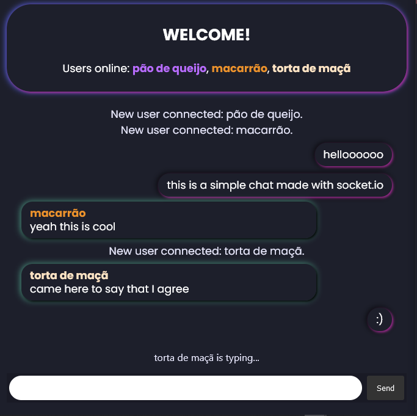

## Neon chat

I was curious to understand how websockets work, so I decided to pick up [this tutorial](https://socket.io/get-started/chat). This project is an extension of that tutorial, with several additional features.

I used [this](https://codepen.io/AllThingsSmitty/pen/jommGQ) as a template for the front-end.

